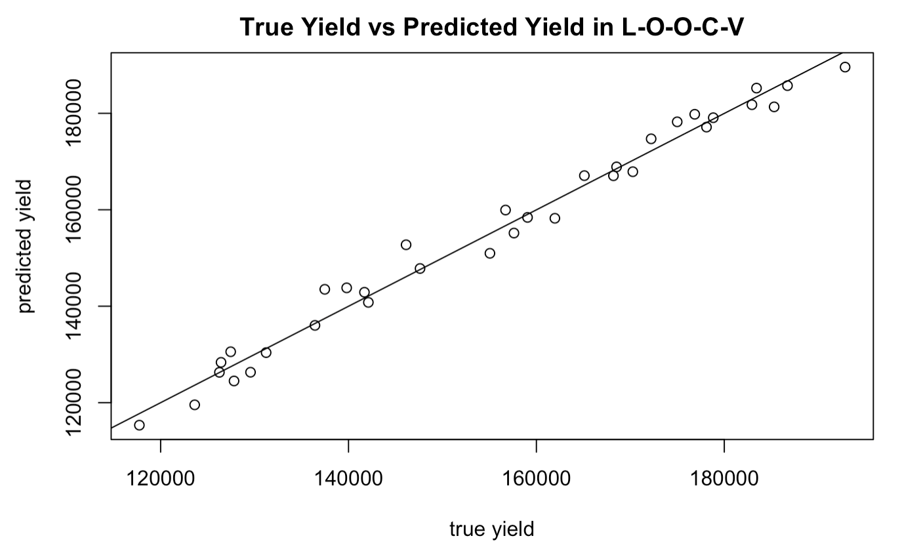
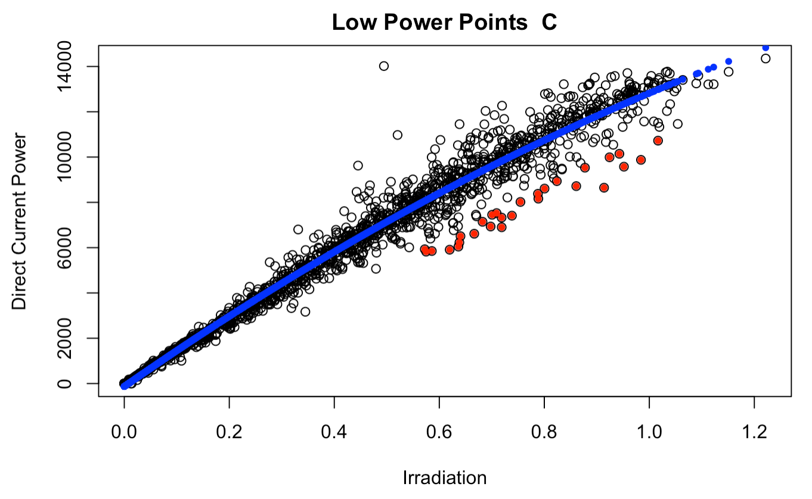
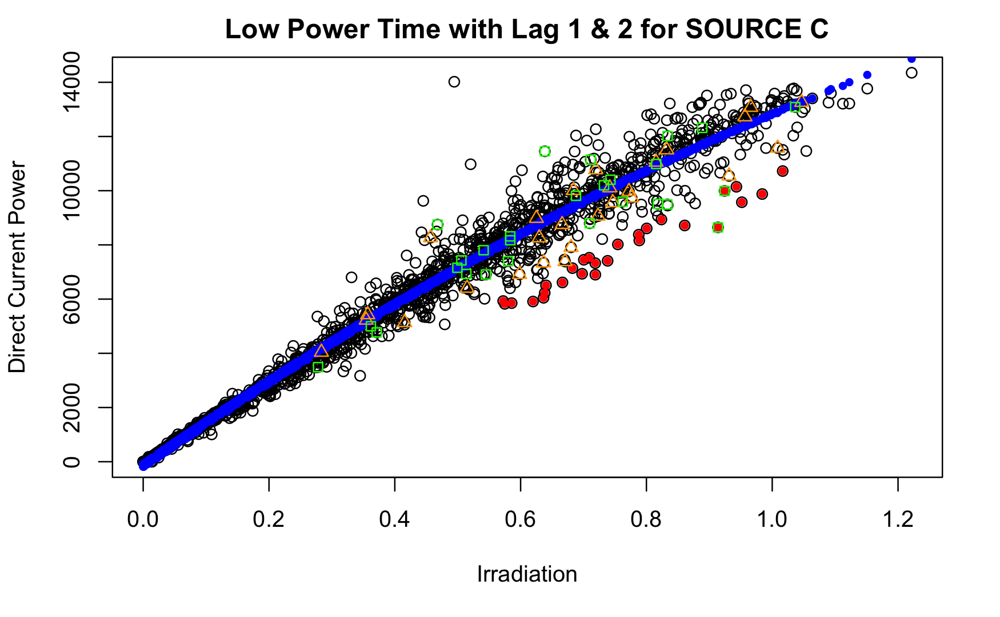
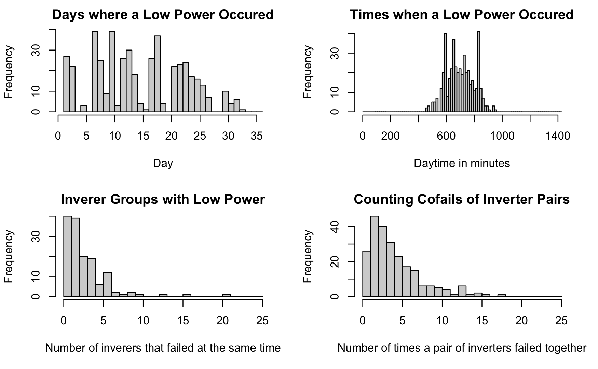

# Solar Power Generation Data Analysis

This repository gives an analysis of 34 days of solar power plant data, as found on kaggle.com at:

> [Solar Power Generation Data](https://www.kaggle.com/datasets/anikannal/solar-power-generation-data)

## Background
Solar power is generated when sunlight strikes solar panels rigged to harness solar energy. Multiple solar panels are rigged up to an inverter, which converts the direct current generated by the solar panel group into alternating current. In our data set, two solar power plants each have 22 inverters supplying power to the plant. Measurements of each inverter's power yield are reported every 15 minutes. Additionally, for every 15 minute interval we also have environmental data giving the current plant temperature, individual temperatures associated with each inverter, and the irradiation (sunlight) intensity at the plant. We have 34 days of continuous measurements of such data.

## Goal

The goal is to investigate the data to answer the following questions:

1) Can we predict daily power yield given a weather prediction?
2) Can we identify underperforming power inverters?
3) Can we predict when a power inverter will underperform?

## Results
A full report with extra analysis can be found in ```Solar Panel Under-performance and Daily Yield Predictions based on Weather Forecasts.pdf```. General results are as follows:

### Predict Power Generation given Irradiation

We find that among all weather measurements that can act as a predictor to an inverter's power generation, irradiation is the only significant predictor. We attempt polynomial, ridge, lasso, and spline regression, finding more advanced methods do not significantly improvement on quadratic regression, which has an average $R^2$ value among all inverters of 0.9762. We proceed by using quadratic regression to model inverter power yeild as a function of irradiation.

### Predict Yield Given a Day's Irradiation Measurements



Using the quadratic regression, we can predict the 15-minute power yield of each inverter given an irradiation measurement. With this, we can predict total plant yield given a day's worth of irradiation measurements. Using Leave-One-Out-Cross-Validaiton, we get an $R^2$ of 0.983.

### Identify Inverter Underperformance

We consider the residuals obtained by subtracting the regression prediction from the yield measurements. We generously label under-performing yields as any yield that is three standard deviations below the mean. Above we give a picture of the fit in blue and low-power points in red.

### Predict when an Inverter will Underperform

For each data point we identify the previous five residuals, called lag1,...,lag5. We then attempt to use the lags as a predictor of whether the inverter will give low yield. The reasoning is that perhaps there is a dip or erratic fluctuation in performance before a low-power yield. Using lda, qda, glm, and knn, no method significantly predicted when a low-power yield would occur. We attempt data-balancing, to no effect. This indicates that recent performance is not an indicator of low-power yield.

### Odd Circumstances of UnderPerformance

We identified odd circumstances around low-yield (low-power) times that indicate the events are not random. It appears that low-power times are not distributed evenly among the days or times. There are very few times when more than 10 inverters give low power simultaneously, and when multiple inverters give low power, it is usually only 2-4. However, there are some pairs of inverters that give low power together 10+ times. We also saw some inverters has very high residual correlations. This suggests that some inverters perform together, perhaps because they are close to each other in the plant or are connected by some sort of wiring.

## Contents
The work is written in R markdown. Analysis is primarily on power-plant 1 data. For information on the data, see [here](https://www.kaggle.com/datasets/anikannal/solar-power-generation-data). The contents of each R markdown file is as follows:

The data (power yields and weather sensors for two plants) -
```
Powerplant Data
```

Cleans the data (run first, requires ~ 4 min) -
```
pp-clean-data.Rmd
```

Investigates how to predict power-yield for a single time interval -
```
pp-power-regression.Rmd
```

Forcasts daily power yield given irradiation measurements -
```
pp-yield-forcasting.Rmd
```

Identifies when low power-yield occurs, reports methods used to try to predict low power-yield, and investigates correlation of performance between different inverters & other odd circumstances of low power-yield -
```
pp-find-fail.Rmd
```
