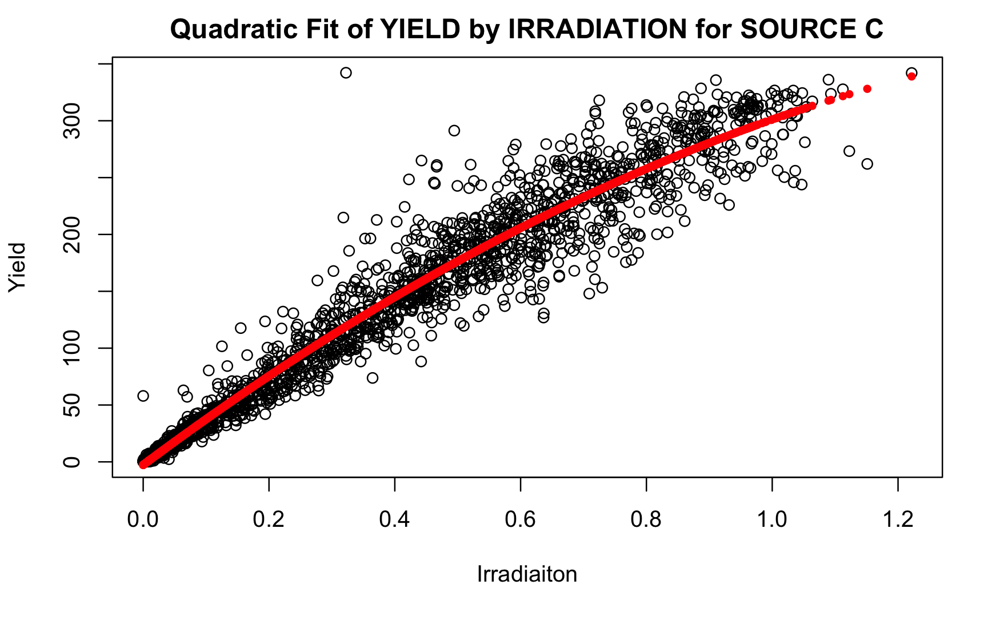

# Solar Power Generation Data Analysis

This repository gives an analysis of 34 days of solar power plant data, as found at:

> [Solar Power Generation Data](https://www.kaggle.com/datasets/anikannal/solar-power-generation-data)

## Background
Solar power is generated when sunlight strikes solar panel rigged to harness solar energy. Multiple solar panels are rigged up to an inverter, which converts the direct current generated by the solar panel group into alternating current. In our data set, two solar power plants each have 22 inverters supplying power to the plant. Measurements of each inverter's power yield are reported every 15 minutes. Additionally, for every 15 minute interval we also have enviornmental data giving the current plant temperature, individual temperatures associated with each inverter, and the irradiation (sunlight) intensity at the plant. We have 34 days of continuous measurements of such data.

## Goal

The goal is to investigate the data to answer the following questions:

1) Can we predict daily power yield given a weather prediction?
2) Can we identify underperforming power inverters?
3) Can we predict when a power inverter will underperform?

## Results
A full report with extra analysis can be found in ```Solar Panel Under-performance and Daily Yield Predictions based on Weather Forecasts.pdf```. General results are as follows:

### Predict Power Generation given Irradiation

We find that among all weather measurements that can act as a predictor to an inverter's power generation, irradiation is the only significant predictor. We attempt polynomial, ridge, lasso, and spline regression, finding more advanced methods do not significantly improvement on quadratic regression, which has an average $R^2$ value among all inverters of 0.9762. We proceed buy using quadratic regression to model inverter power yeild as a funciton of irradiation.

### Predict Yield Given a Day's Irradiation Measurements

Using the quadratic regression, we can predict the 15-minute power yield of each inverter given an irradiation measurement. With this, we can predict total plant yield given a day's worth of irradiation measurements. Using Leave-One-Out-Cross-Validaiton, we get an $R^2$ of 0.983.

### Identify Inverter Underperformance

We consider the residuals obtained by subtracting thre regression prediiton from the yield mesurements. We generously label under-performing yields as any yield that is three standard deviations below the mean. Above we give a picture of the fit in blue and low-power points in red.

### Predict when an Invdrter will Under-perform

For each data point we identify the previous five residuals, called lag1,...,lag5. We then attempt to use the lags as a predictor of wheather the inverer will give low yield. The reasoning is that perhaps there is a dip or erratic fluctuation in performance before a low-power yield. Using lda, qda, glm, and knn, no method significantly predicted when a low-power yield would ocure. We attempt data-ballancing, to no effect. This indicates that recent performance is not an indicator of low-power yield.

## Contents
The work is written in R markdown. Analysis is primarily on powerplant 1 data. For information on the data, see [here](https://www.kaggle.com/datasets/anikannal/solar-power-generation-data). The contents of each R markdown file is as folows:

The data (power yields and weather sensors for two plants) -
```
Powerplant Data
```

Cleans the data (run first, requires ~ 4 min) -
```
pp-clean-data.Rmd
```

Investigates how to predict power-yield for a single time interval -
```
pp-power-regression.Rmd
```

Forcasts daily power yield given irradiation measurements -
```
pp-yield-forcasting.Rmd
```

Identifies when low power-yield occures, reports methods used to try to predict low power-yield, and investigates correlation of performance between different inverters -
```
pp-find-fail.Rmd
```
